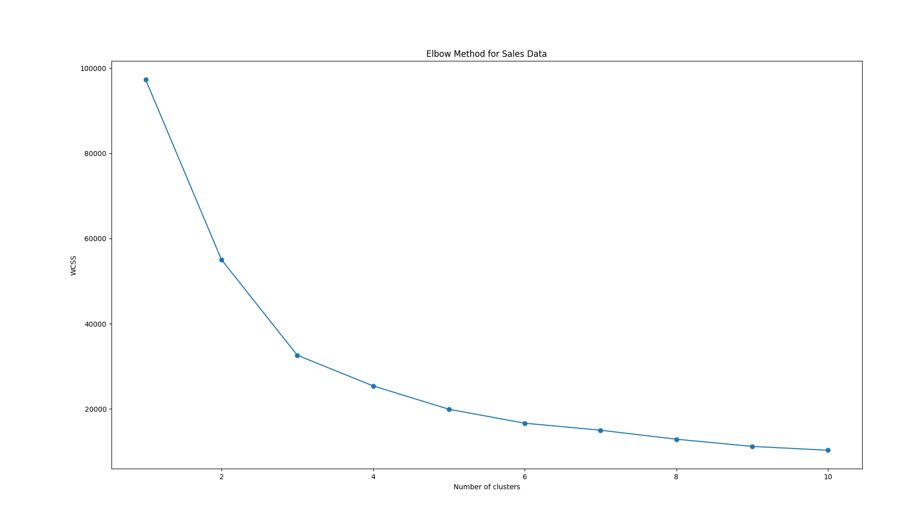

# IAIP
Sales Data Analysis project using Python: Cleaned sales data, applied KMeans clustering to segment orders, visualized clusters, and analyzed sales trends.
# Sales Data Analysis - IAIP Internship Task

## Objective
Analyze sales data to identify trends, seasonal effects, and performance of different products using Python.

## Dataset
- Kaggle SuperStore Sales Data (`SuperStoreOrders.csv`)
- Contains columns like quantity, sales, product, region, and order details.

## Tools Used
- Python
- Pandas (data manipulation)
- Matplotlib & Seaborn (visualizations)
- Scikit-learn (KMeans clustering)
- Excel (optional for viewing CSV)

## Steps Performed
1. Loaded and cleaned the sales dataset
2. Converted sales and quantity to numeric values and handled missing data
3. Used KMeans clustering to segment orders into 4 clusters
4. Labeled clusters as High, Medium, Low, and Very Low Sales
5. Visualized clusters using scatterplots and boxplots
6. Calculated average sales and quantity per cluster
7. Saved the final dataset with cluster labels for reporting

## Insights
- High Sales cluster contains orders with the highest sales and quantity
- Medium and Low Sales clusters help identify average-performing orders
- Very Low Sales cluster contains minimal orders with small sales

## Files in this Repository
- `main.py` → Python script for analysis
- `SuperStoreOrders_Clustered.csv` → Final dataset with cluster labels
- Plots (optional) → Visualizations of clusters
- ## Cluster Visualization

